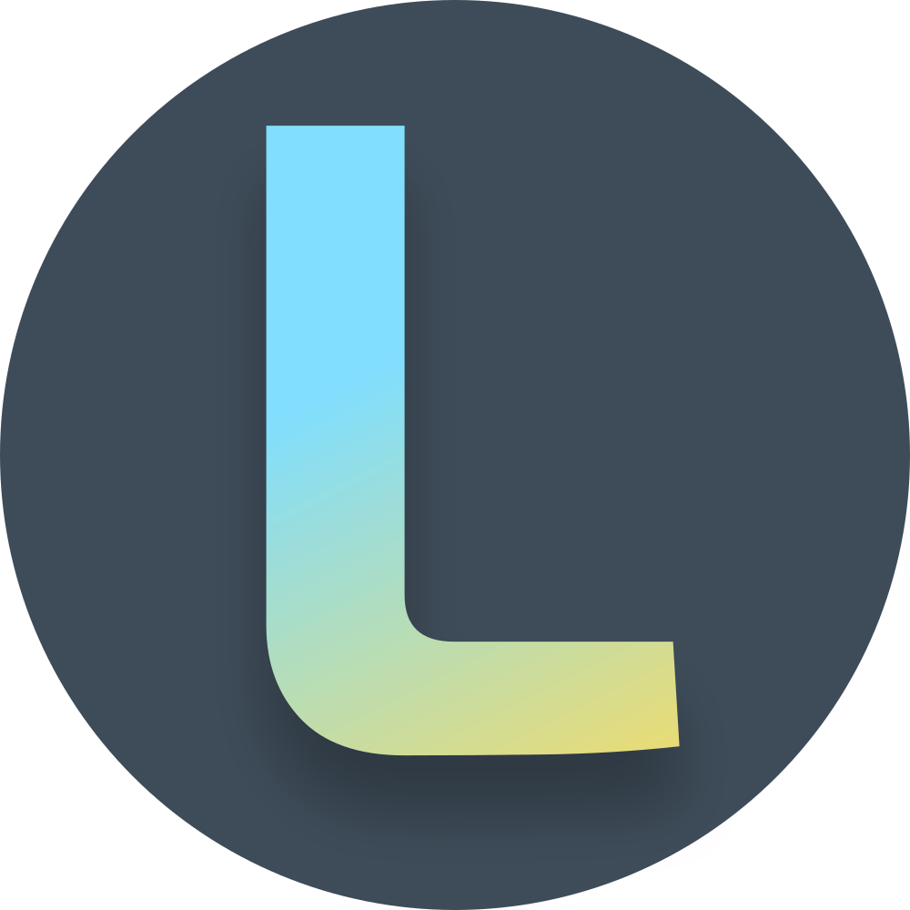

# Loot &middot; Rock Paper Scissors &middot; 

  

<b>A Loot blockchain demo game</b>

---

## Development
1) Open the game in Godot
2) Run the game through the run button in the top right corner of the editor.

### Build
1) Follow the build instructions here https://docs.godotengine.org/en/stable/getting_started/workflow/export/exporting_projects.html

## Running
1) Run the generated executable from building.

## License

- This software is licensed under [Apache 2.0](LICENSE).
